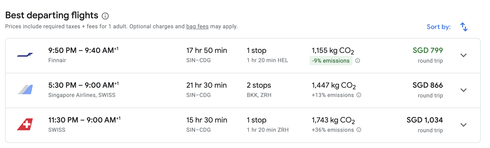
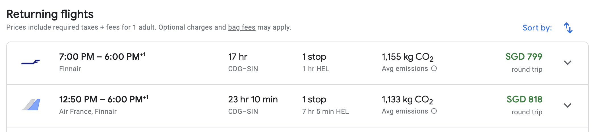
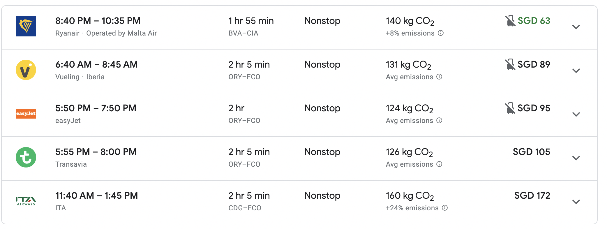

# Travel Details

## Round Trip Flights 
Round trip between Singapore and Paris in May is around *S$799 - S$1100*, with a duration of *16 - 24 hours* per trip.  

 Typical Departure Flight 

 Typical Returning Flight 

___

## Singapore to France
* Estimated travel effort: *16 - 22 hours*
* Estimated cost: *S$500*

## France to Italy (Paris to Rome)
* Estimated travel effort: *2 hours*
* Estimated cost: *S$60 - S$100*
  

 Typical Flights 

## Italy 
1. Train from Rome to Florence

2. Train from Florence to Venice

3. Train from Venice to Florence

## Italy to Greece (Rome to Athens)
### Athens
### Santorini
